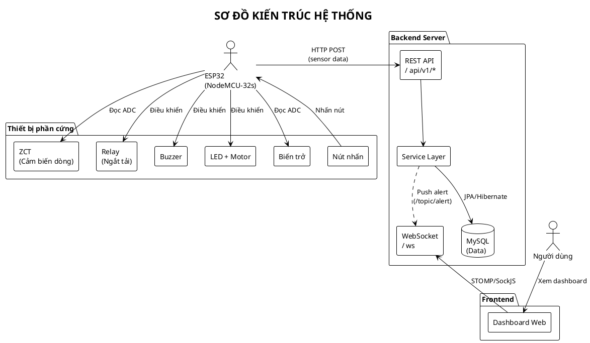
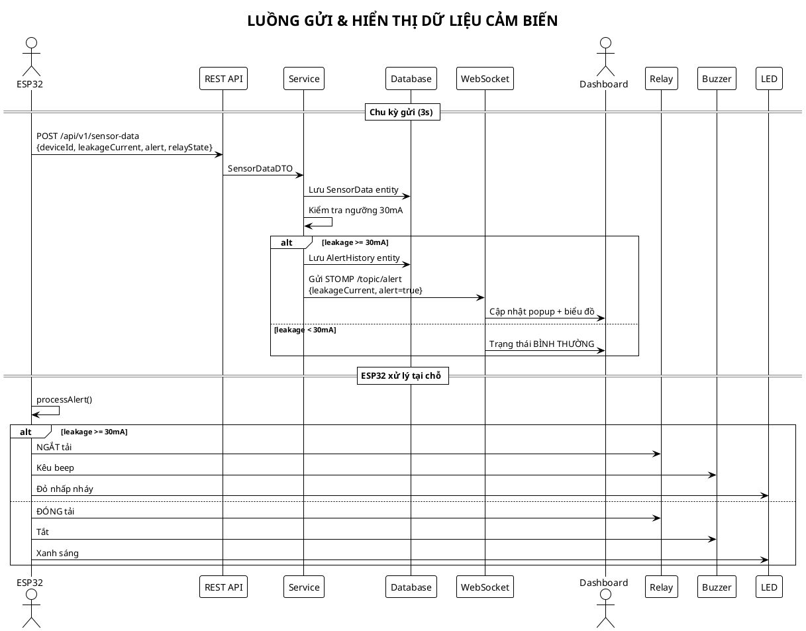
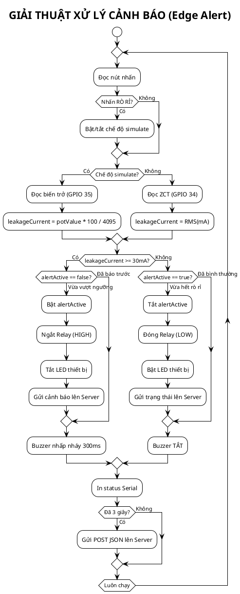
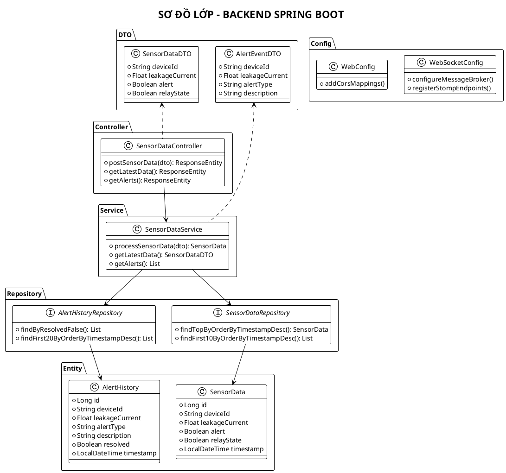
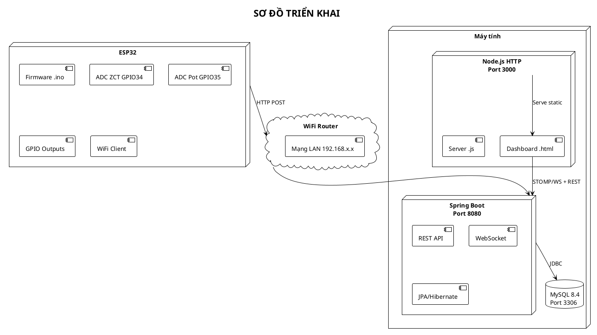

# PlantUML Diagrams cho Báo Cáo Đồ Án

Copy từng đoạn code vào https://www.plantuml.com/ hoặc tool PlantUML offline.

---

## 1. KIẾN TRÚC HỆ THỐNG (Component Diagram)

---

## 2. LUỒNG DỮ LIỆU (Sequence Diagram)

---

## 3. GIẢI THUẬT FIRMWARE (Activity Diagram)

---

## 4. LỚP BACKEND (Class Diagram)

---

## 5. TRIỂN KHAI HỆ THỐNG (Deployment Diagram)

